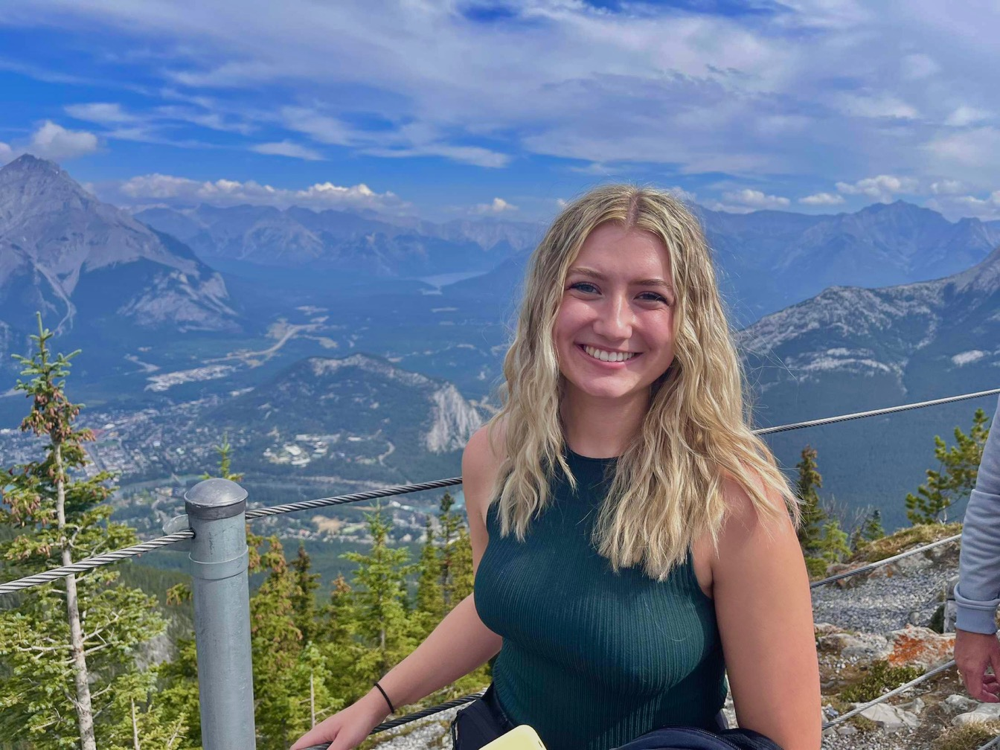
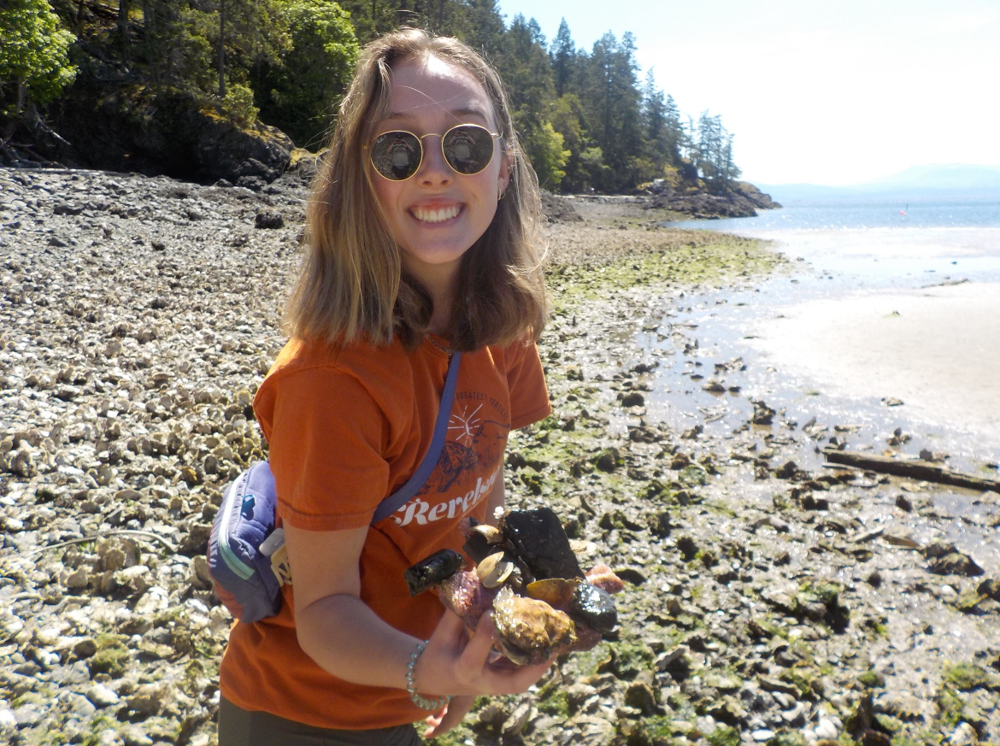
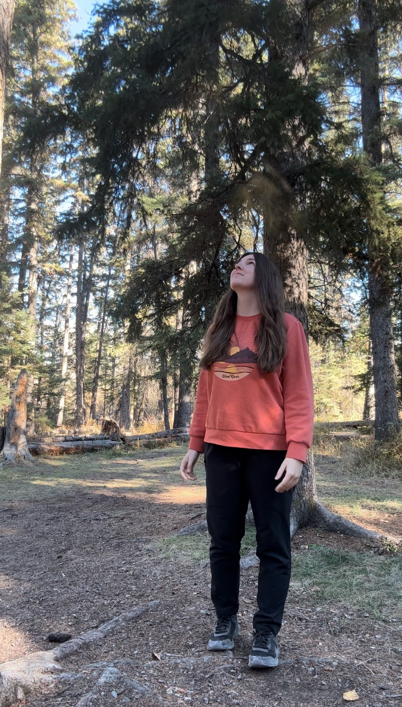
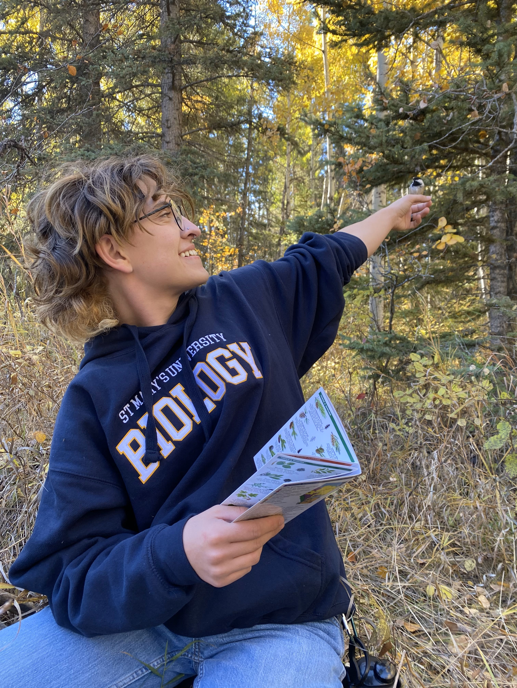

# Current Student Projects

# 1. Leah Earle  

  
My name is Leah Earle and I’m currently enrolled in the undergraduate biology honors program at stmu. This year I am completing my honors research project. I have a wide span of research interests including things such as animal and plant ecology, evolution, biological conservation and microbiology. I enjoy being outside and being able to view all the organisms the world has to offer. As well, I love learning new things and being able to share my knowledge with others. Currently, my research is comparing Hymenopteran diversity across different levels of urban development in rapidly expanding Calgary, AB. Many of the Hymenoptera are important pollinators (e.g., _Bombus_ spp), and therefore important bioindicators of environmental health. My results will estimate the rate of habitat loss and degredation due to urbanization.  

# 2. Marisa Kenna  
 

My name is Marisa Kenna and I am part of the undergraduate biology program at stmu, currently completing my senior capstone project. My research interests focus primarily on plant ecology. I enjoy being in nature as much as possible to see plants in their natural habitat to better understand their ecology. My research employs aster models to compare variation in life-history traits in paintbrush (_Castillja incarnata_) off the coast of Vancouver Island and in Southern Alberta. My goal is to quantify the differences is various traits (e.g., flower size/number, flowering duration, etc.) between two very different environments to describe the fitness consequences of region-specific life-history characteristics.  

# 3. Cassidy Moline  
 

My name is Cassidy, and I am in my final year of a biology degree at St. Mary’s University. I am interested in molecular ecology, especially its application to conservation efforts for a wide variety of species! I love both field and lab work and enjoy spending as much time in nature as possible. My capstone project utilizes a molecular ecology approach to quantify the scope and potential spread of an invasive plant species in Fish Creek Provincial Park.  

# 4. Oliver Noseworthy  
 

My name is Oliver, and I chose to research the individual flowering schedules and within individual variation gradients of _Brassica rapa_. I decided to do this because I've always been intrigued as to how plants work, and the mechanisms behind their success. After a conversation I had with Dr. Kulbaba regarding his previous work I discovered that there was much more to plants floral displays and functions than I had realized beforehand. This realization, and want to answer the questions that arise fueled my motivation to pursue the capstone project at St. Mary's University. I love learning new things, and so working on this project was an amazing way to do so.  

# 5. Megan Fraser  
 

[Home](index.md)
