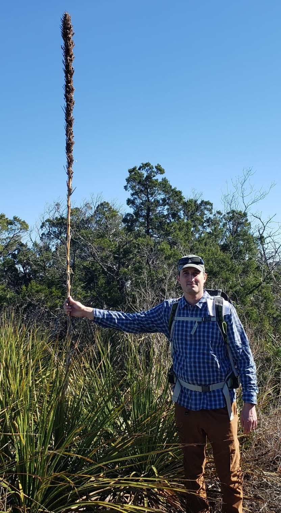

## Dr. Mason W. Kulbaba  

## Position
Assistant Professor  
Herbarium (STMU) Curator  

## Contact
**Email**: mason.kulbaba(at)stmu.ca  
**Post**: 14500 Bannister Rd. SE  
          Calgary, Alberta  
          T2X 1Z4  
## Links
Photos [Photos](photos.md)

## Education and Experience
2023 - *present*     Assistant Professor & Herbarium Curator. Biology, St. Mary's University, Calgary AB, Canada.  
2020 - 2023          Assistant Professor & Herbarium Curator. Biology, Our Lady of the Lake University, San Antonio, TX, USA.  
2018 - 2019          Postdoc. Dept. Biologial Sciences. University of Calgary  
          Supervisor: [Dr. Lawrence D. Harder](https://profiles.ucalgary.ca/lawrence-harder)  
2016 – 2018          Postdoc. Dept. Ecology, Evolution, and Behavior. University of Minnesota  
          Supervisor [Dr. Ruth G. Shaw](https://ruthgshaw.wordpress.com/news-archive/people/)  
2013 – 2016	Postdoc. Dept. Biological Sciences. University of Calgary  
          Supervisor: [Dr. Lawrence D. Harder](https://profiles.ucalgary.ca/lawrence-harder)  
2007 – 2012	Phd. Dept. Botany. University of Manitoba  
          Advisor: [Dr. Anne C. Worley](https://sci.umanitoba.ca/biological-sciences/profiles/anneworley/)  
2002 – 2007	B.Sc. Dept. Biological Sciences. University of Winnipeg  
          Honours Advisor: [Dr. Richard J. Staniforth](https://www.naturemanitoba.ca/news-articles/tribute-richard-staniforth-1946-2022)

## Research Interests

## Current Teaching
### Fall 2024 
* BIOL 307 - Ecology and Human Affairs  
* BIOL 313 - Introduction to Ecology and Evolution  
* BIOL 451 - Biological Conservation (with student internship)  

### Winter 2025
* BIOL 315 - Biostatistics (with R-based lab/tutorial)  
* BIOL 417 - Tropical Ecology Field School (travel study course to Belize)  

## Publications
### *In Review*
Redick, R., ***Kulbaba, M. W.***, and S. Vamosi. Microsatellite markers support two distinct introductions of Scotch Broom (*Cytisus scoparius*) to Vancouver Island  

***Kulbaba, M. W.*** and L. D. Harder. A SNP-based approach to estimating the mating and relatedness components of plant mating portfolios.

### *Published*
**2023**  
***Kulbaba, M. W.***, Yoko, Z., and J. Hamilton. 2023. Chasing the fitness optimum: temporal variation in the genetic and environmental expression of life-history traits for a perennial plant. Annals of Botany. 132: 1191–1204. [LINK](https://watermark.silverchair.com/mcad100.pdf?token=AQECAHi208BE49Ooan9kkhW_Ercy7Dm3ZL_9Cf3qfKAc485ysgAAA0wwggNIBgkqhkiG9w0BBwagggM5MIIDNQIBADCCAy4GCSqGSIb3DQEHATAeBglghkgBZQMEAS4wEQQMwoluxsI_A8BlxejPAgEQgIIC_0m_BALVMS-SyDHFIOXKmciJoFaK3ilkXQ4y3tN7NwszGVb0GSkrW2rA5ABUO_w8HQAwMeMAy3Gi5S1APALeygTFbi4iboY1OCoAR6pwL7bI5Mrz_-rlVzeICfuQ0Bvkjaz9T-f8gsexG3_PMRJc59KE--Ha0BGeai7oRYV4Yiu9OGpJBAQPDSNNeG8Cs6sp9rTL7H9kzE1JmXzSlhoV2AoCKH4F82ud8SgWea2p2QWzbhqmMH9ZbN38evEKngSF_GqSr3yePJ7sv514Tx3AbJ_6tTygGcffjolYBe1gtcbsbOI1DfHjCgHk6fXTH2anBvQMg8YJj6g5-jxpvTTQk1nf3sBwLkin8AAhng7ixuZlL5PddsIgv1hvfBmFQ9_QvBFvz8W8RdZtZbnR560buSEJVJsb3fkHm8LAdjqBsNndOB1bbP_qFTsddr7Zxo6aUfzdji0MogVI9dnQLHGufmeD9VUuO2eacNCMQIoecKP8rfVtW_DNo6CoJGEyUDqmcpZi7ShvSC-PiGzl6UERRAH2T081CtB3Ds3GFccxLGPUlpqaFQ4gTd3-NYaZWmzOiTWb-o_ELUYedlv0dnmHUvbeRhjxsJ3v2jLECj-4IBz-2d2iGsVvPO1PmvNv0D1ANdelfcY_bH-K6u1rTrvMbNSzQOYerFfVUKmfi5e6nxFcbaX03QTTNDOu2_74VRclc0EVdfJs-BYV9Igvk_bsv8pCZoa0rl2WehV1LHKqSwEeQ-9cHXVvbeDN52ArDZyPB0NIq1VvTcMtaWrGc8ybMVfrg3TksXVDwylSY_PgPvlBMAq5rigDoUd3KPsWpPepoKa1wo7es82WSsatX8Ty7FgLEyjTlmxcVqvJIL1Lnf6nmh__sJ_SdsMGAcPB_yUZZyhZbnPCV4DSf6ODZSpnEOu771_EOh6ZQaPO3uGYAdIi-lRn4Ckk4ooo1ENW8G_gNhpEoklzWct39UF74FZ3vNwv_c_wllDCQjI20nHDmAahZiQybul662k2ksI20-d6)  

⚡: Commentary by Dr. Meredith A. Zettlemoyer [PDF](Pubs/Zettlemoyer commentary.pdf)  

**2021**  
***Kulbaba, M. W.*** and R. G. Shaw. 2021. Lifetime fitness through female and male function: influences of genetically effective population size and density. American Naturalist 197: 434-447. [PDF](Pubs/Kulbaba and Shaw 2021 density Ne.pdf).  

**2019**  
***Kulbaba, M. W.***, Sheth, S. N., Paine, R. E., Eckhart, V. M., Shaw. R. G. 2019. Additive genetic variance for lifetime fitness and the capacity for adaptation in an annual plant. Evolution 73: 1558-5646. [PDF](Pubs/Kulbaba et al  2019 capacity for adaptation.pdf).  

Harder, L.D., Strelin, M.M, Clocher, I.C, ***Kulbaba, M.W.*** and M. A. Aizen. 2019. The dynamic mosaic phenotypes of flowering plants. New Phytologist 224: 1021-1034. *Special issue: The ecology, evolution, and genetics of plant reproductive systems. [PDF](Pubs/Harder et al 2019 dynamic mosaic.pdf)  

**2018**  
Sheth, S. N., ***Kulbaba, M. W.***, Pain, R. E., and R. G. Shaw 2018. Expression of additive genetic variance for fitness in a population of partridge pea grown in two field sites. Evolution 72: 2537-2545. [PDF](Pubs/Sheth et al 2018 GxE.pdf)  

Tomaszewski, C., ***Kulbaba, M. W.*** and L. D. Harder. 2018. Mating consequences of contrasting hermaphroditic plant sexual systems. Evolution 70 (10): 2114-2128. [PDF](Pubs/Tomaszewski et al 2018  Anticlea.pdf)  

**2017**  
***Kulbaba, M. W.***, Clocher, I. C., and L. D. Harder. 2017. Inflorescence characteristics as function-valued traits: analysis of heritability and selection on architectural effects. Journal of Systematics and Evolution 55 (6) 559 – 565. *Invited for special issue on inflorescence displays. [PDF](Pubs/Kulbaba et al. 2017 fvt.pdf).  

**2014**  
***Kulbaba, M. W.*** and A. C. Worley. 2014 Patterns of pollen removal and deposition in Polemonium brandegeei (Polemoniaceae): the role of pollinators, floral design and sexual interference. Plant Biology 16: 1087-1095. [PDF](Pubs/Kulbaba and Worley 2014 - Patterns of pollen.pdf).  

**2013**  
***Kulbaba, M. W.*** and A. C. Worley. 2013. Selection on Polemonium brandegeei (Polemoniaceae) flowers under hummingbird pollination: opposing, parallel or independent of selection by hawkmoths? Evolution 67: 2194-2206. [PDF](Kulbaba and Worley 2013 hummingbird pollination.pdf).  

**2012**  
***Kulbaba, M. W.*** and A. C. Worley. 2012. Selection on floral design in Polemonium brandegeei (Polemoniaceae): female and male fitness under hawkmoth pollination. Evolution 66: 1344-1359. [PDF](Pubs/Kulbaba and Worley  2012 hawkmoth pollination.pdf).  

**2011**  
***Kulbaba, M. W.*** and A. C. Worley. 2011. Polymorphic microsatellite loci in Polemonium brandegeei and P. viscosum. American Journal of Botany 98: e4-e6. [PDF](Pubs/Kulbaba and Worley 2011 microsats).  

**2009**  
***Kulbaba, M. W.***, Tardif, J. and R. J. Staniforth. 2009. Morphological and ecological relationships between burrs and furs. American Midland Naturalist 161: 380-391. [PDF](Pubs/Kulbaba et al 2009 epizoochory.pdf).  

**2008**  
***Kulbaba, M. W.*** and A. C. Worley. 2008. Floral design in Polemonium brandegeei (Polemoniaceae): genetic and phenotypic variation under hawkmoth and hummingbird pollination. International Journal of Plant Sciences 169: 509-522.[PDF](Pubs/Kulbaba and Worley  2008  floral design). 
